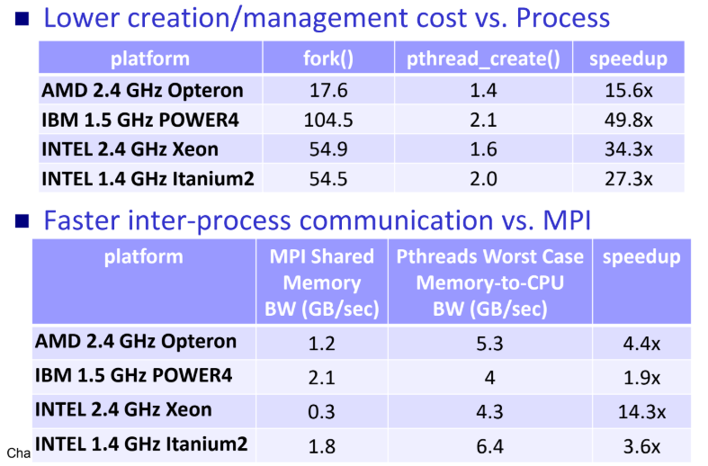
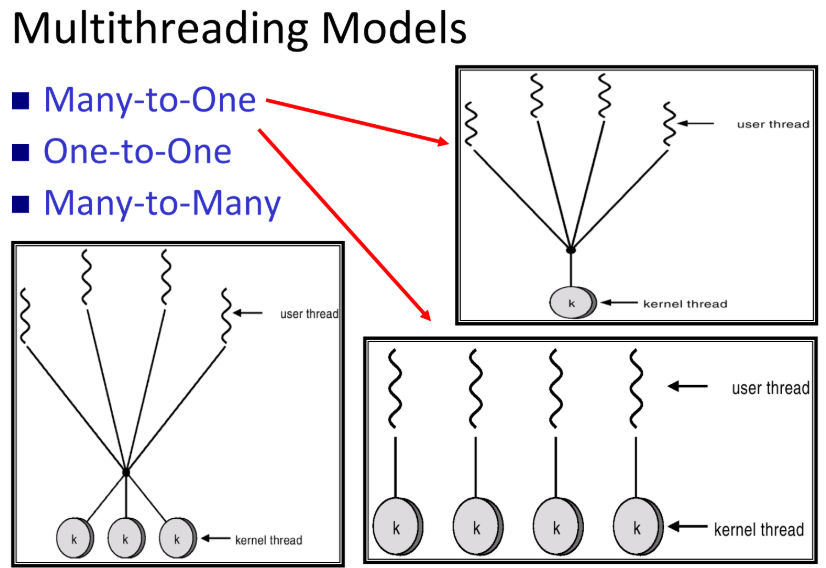

# Multithreaded Programming

Overview

- Thread Introduction
- Multithreading Models
- Threaded Case Study
- Threading Issues

## Thread Introduction

### Thread

- thread a.k.a lightweight process: basic unit of CPU utilization
- all threads belonging to the same process share: code section, data section, and OS resources (e.g. open files and signals)
- But each thread has its own (thread control block): thread ID, program counter, register set, and a stack


### Motivation

- Example: a web browser
  - One thread displays contents while the other thread receives data from network
- Example: a web server
  - One request / process: poor performance
  - One request / thread: better performance as code and resource sharing
- Example: RPC server
  - One RPC request / thread

### Benefits of Multithreading

- Responsiveness: allow a program to continue running even if part of it is blocked or is performing a lengthy operation
- Resource sharing: several different threads of activity all within the same address space
- Utilization of MP (multi processor) architectur e: Several threads may be running in parallel on different processors
- Economy: Allocating memory and resources for process creation is costly. In Solaris, creating a process is about 30 times slower than is creating a thread, and context switching is about five times slower. A register set switch is still required, but no memory-management related work is needed

### Why Thread?



### Multithcore Programming

- Multithreaded programming provides a mechanism for more efficient use of multiple cores and improved concurrency (threads can run in parallel)
- Multicore systems putting pressure on system designers and application programmers
  - OS designers: scheduling algorithms use cores to allow the parallel execution


### Challenges in Multicore Programming

- Dividing activities: divide program into concurrent tasks
- Balance: evenly distribute tasks to cores
- Data splitting: divide data accessed and manipulated by the tasks
- Data dependency: synchronize data access
- Testing and debugging

### User vs. Kernel Threads

User threads – thread management done by user-level threads library
- POSIX Pthreads
- Win32 threads
- Java threads

Kernel threads – supported by the kernel (OS) directly
- Windows 2000 (NT)
- Solaris
- Linux
- Tru64 UNIX

User threads
- Thread library provides support for thread creation,
scheduling, and deletion
- Generally fast to create and manage
- If the kernel is single-threaded, a user-thread blocks -> entire process blocks even if other threads are ready to run

Kernel threads
- The kernel performs thread creation, scheduling, etc.
- Generally slower to create and manage
- If a thread is blocked, the kernel can schedule another thread for execution

## Multithreading Models



### Many-to-One

- Many user-level threads mapped to single kernel thread
- Used on systems that do not support kernel threads
- Thread management is done in user space, so it is efficient
- The entire process will block if a thread makes a blocking system call
- Only one thread can access the kernel at a time, multiple threads are unable to run in parallel on multiprocessors

### One-to-One

- Each user-level thread maps to a kernel thread
- There could be a limit on number of kernel threads
- More concurrency
- Overhead: Creating a thread requires creating the corresponding kernel thread
- Examples
  - Windows XP/NT/2000
  - Linux
  - Solaris 9 and later

### Many-to-Many

- Multiplexes many user-level threads to a smaller or equal number of kernel threads
- Allows the developer to create as many user threads as wished
- The corresponding kernel threads can run in parallel on a multiprocessor
- When a thread performs a blocking call, the kernel can schedule another thread for execution

## Case Study
- Thread libraries
  - Pthreads
  - Java threads
- OS examples
  - WinXP
  - Linux

### Shared-Memory Programming

- Definition: Processes communicate or work together with each other through a shared memory space which can be accessed by all processes
  - Faster & more efficient than message passing
- Many issues as well:
  - Synchronization
  - Deadlock
  - Cache coherence
- Programming techniques:
  - Parallelizing compiler
  - Unix processes
  - Threads (Pthread, Java)

### What is Pthread?

- Historically, hardware vendors have implemented their own proprietary versions of threads
- POSIX (Portable Operating System Interface) standard is specified for portability across Unix-like systems
- Similar concept as MPI for message passing libraries
- Pthread is the implementation of POSIX standard for threads

### Pthread Creation

- pthread_create(thread,attr,routine,arg)
  - thread: An unique identifier (token) for the new thread
  - attr: It is used to set thread attributes. NULL for the default values
    - for example, bind the thread to a specific CPU core
  - routine: The routine that the thread will execute once it is created
  - arg: A single argument that may be passed to routine

``` c++
#include <pthread.h>
#include <stdio.h>
#define NUM_THREADS 5

void *PrintHello(void *threadId) {
    long* data = static_cast <long*> threadId;
    printf("Hello World! It's me, thread #%ld!\n", *data);
    pthread_exit(NULL);
}

int main (int argc, char *argv[]) {
    pthread_t threads[NUM_THREADS];
    for (long tid = 0; tid < NUM_THREADS; tid++) {
        pthread_create(&threads[tid], NULL, PrintHello, (void *)&tid);
    }
    /* Last thing that main() should do */
    pthread_exit(NULL);
}
```

### Pthread Joining & Detaching

- pthread_join(threadId, status)
  - Blocks until the specified threadId thread terminates
  - One way to accomplish synchronization between threads
  - Example: to create a pthread barrier `for (int i = 0; i < n; i++) pthread_join(thread[i], NULL);`

- pthread_detach(threadId)
  - If we don't want to join a thread, we can detach it
  - Once a thread is detached, it can never be joined
  - Detach a thread could free some system resources

### Java Threads

- Thread is created by
  - Extending Thread class
  - Implementing the Runnable interface
- Java threads are implemented using a thread library on the host system
  - Win32 threads on Windows
  - Pthreads on UNIX-like system
- Thread mapping depends on implementation of the JVM
  - Windows 98/NT: one-on-one model
  - Solaris 2: many-to-many model

### Linux Threads
- Linux does not support multithreading (no threads in the kernel)
- Various Pthreads implementation are available for user-level
- The fork system call – create a new process and a copy of the associated data of the parent process
- The clone system call – create a new process and a link that points to the associated data of the parent process
- A set of flags is used in the clone call for
indication of the level of the sharing
  - None of the flags is set -> clone = fork
  - All flags are set -> parent and child share everything

## Threading Issues

- Semantics of fork() and exec() system calls. Duplicate all the threads or not?
- Thread cancellation: Asynchronous or deferred
- Signal handling: Where then should a signal be delivered?
- Thread pools: Create a number of threads at process startup.

### Semantics of fork() and exec()

- Does fork() duplicate only the calling thread or all threads?
  - Some UNIX system support two versions of fork()
- execlp() works the same; replace the entire process
  - If exec() is called immediately after forking, then duplicating all threads is unnecessary


The middle image is a fork that duplicates all threads, while the right image is a fork that duplicates only the calling thread.

### Thread Cancellation

- What happen if a thread determinates before it has completed?
  - e.g, terminate web page loading
- Target thread: a thread that is to be cancelled
- Two general approaches:
  - Asynchronous cancellation: 
    - One thread terminates the target thread immediately
  - Deferred cancellation (default option):
    - The target thread periodically checks whether it should be terminated, allowing it an opportunity to terminate itself in an orderly fashion (canceled safely)
    - Check at Cancellation points

### Signal Handling

- Signals (synchronous or asynchronous) are used in UNIX
systems to notify a process that an event has occurred
  - Synchronous: illegal memory access, division by zero
  - Asynchronous: control+C to terminate a process
- A signal handler is used to process signals
  1. Signal is generated by particular event
  2. Signal is delivered to a process
  3. Signal is handled
- Options
  - Deliver the signal to the thread to which the signal applies
    - e.g. sleep
  - Deliver the signal to every thread in the process
    - e.g. process is killed
  - Deliver the signal to certain threads in the process
  - Assign a specific thread to receive all signals for the process

### Thread Pools

- Create a number of threads in a pool where they await work
- Advantages
  - Usually slightly faster to service a request with an existing thread than create a new thread
  - Allows the number of threads in the application(s) to be bound to the size of the pool
- \# of threads: \# of CPUs, expected \# of requests, amount of physical memory