# Process Scheduling

Overview

- Basic Concepts
- Scheduling Algorithms
- Special Scheduling Issues
- Scheduling Case Study

## Basic Concepts

- The idea of multiprogramming:
  - Keep several processes in memory. Every time one process has to wait, another process takes over the use of the CPU
- CPU-I/O burst cycle: Process execution consists of a cycle of CPU execution and I/O wait (i.e., CPU burst and I/O burst).
  - Generally, there is a large number of short CPU bursts, and a small number of long CPU bursts
  - A I/O-bound program would typically has many very short CPU bursts
  - A CPU-bound program might have a few long CPU bursts

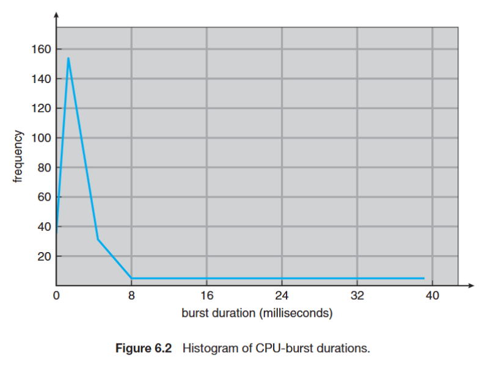

### Preemptive vs. Non-preemptive

- CPU scheduling decisions may take place when a process:
  1. Switches from running to waiting state (e.g., I/O request, wait())
  2. Switches from running to ready state (e.g., interrupt)
  3. Switches from waiting to ready (e.g., I/O completion)
  4. Terminates
- Non-preemptive scheduling (不可打斷調度):
  - Scheduling under 1 and 4 (no choice in terms of scheduling)
  - The process keeps the CPU until it is terminated or switched to the waiting state
  - E.g., Window 3.x
- Preemptive scheduling (可打斷調度):
  - Scheduling under all cases
  - E.g., Windows 95 and subsequent versions, Mac OS X

### Preemptive Issues

- Inconsistent state of shared data
  - Require process synchronization (Chap6)
  - incurs a cost associated with access to shared data
- Affect the design of OS kernel
  - the process is preempted in the middle of critical changes (for instance, I/O queues) and the kernel (or the device driver) needs to read or modify the same structure?
  - Unix solution: waiting either for a system call to complete or for an I/O block to take place before doing a context switch (disable interrupt)

### Dispatcher

- Dispatcher module gives control of the CPU to the process selected by scheduler
  - switching context
  - jumping to the proper location in the selected program
- Dispatch latency – time it takes for the dispatcher to stop one process and start another running
  - Scheduling time
  - Interrupt re-enabling time
  - Context switch time

## Scheduling Algorithms

### Scheduling Criteria

Different performance metrics:

- CPU utilization
  - theoretically: 0% ~ 100%
  - real systems: 40% (light) ~ 90% (heavy)
- Throughput
  - number of completed processes per time unit
- Turnaround time
  - the time from submission time to completion time
- Waiting time
  - total waiting time in the ready queue
- Response time
  - the time from submission time to the first response (first CPU burst)

### Algorithms

- First-Come, First-Served (FCFS) scheduling
- Shortest-Job-First (SJF) scheduling
- Priority scheduling
- Round-Robin scheduling
- Multilevel queue scheduling
- Multilevel feedback queue scheduling

#### First-Come, First-Served (FCFS) Scheduling

- Process (Burst Time) in arriving order: P1 (24), P2 (3), P3 (3)
- The Gantt Chart of the schedule
  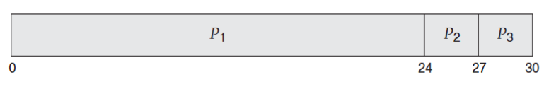
- Waiting time: P1 = 0, P2 = 24, P3 = 27
- Average Waiting Time (AWT): (0+24+27) / 3 = 17
- Convoy effect: short processes behind a long process

If process arrives in another order, the waiting time would be different:

- Process (Burst Time) in arriving order: P2 (3), P3 (3), P1 (24)
- The Gantt Chart of the schedule
  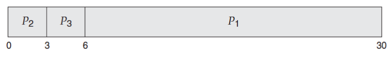
- Waiting time: P1 = 6, P2 = 0, P3 = 3
- Average Waiting Time (AWT): (6+0+3) / 3 = 3

#### Shortest-Job-First (SJF) Scheduling

- Associate with each process the length of its next CPU burst
- A process with shortest burst length gets the CPU first
- SJF provides the minimum average waiting time (optimal!)
- Two schemes
  - Non-preemptive – once CPU given to a process, it cannot be
    preempted until its completion
  - Preemptive – if a new process arrives with shorter burst
    length, preemption happens

Example of Non-preemptive SJF scheduling
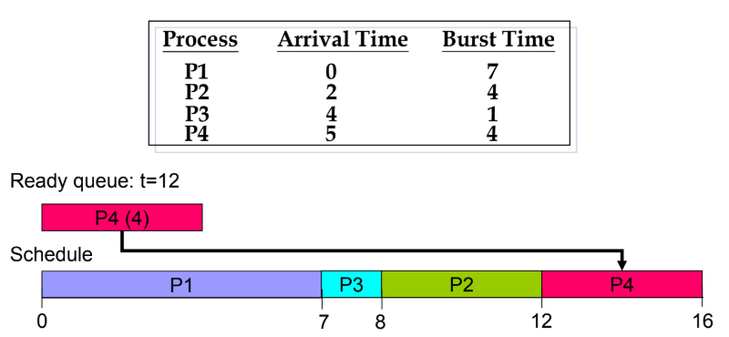

- Wait time = completion time – arrival time – run time (burst time)
- AWT = [(7-0-7)+(12-2-4)+(8-4-1)+(16-5-4)]/4 = (0+6+3+7)/4 = 4
- Response Time: P1 = 0, P2 = 6, P3 = 3, P4 = 7

Example of Preemptive SJF scheduling
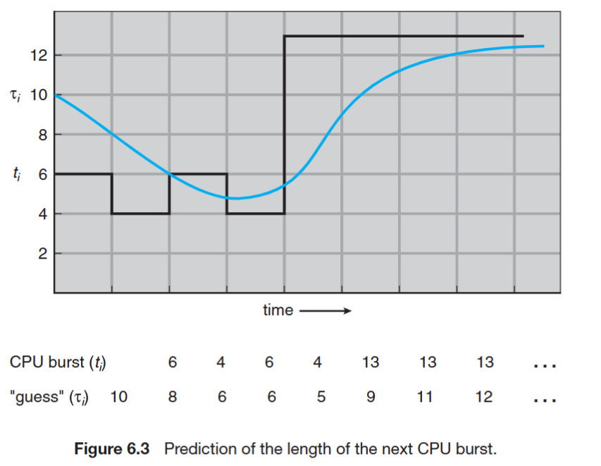

- Wait time = completion time – arrival time – run time (burst time)
- AWT = [(16-0-7)+(7-2-4)+(5-4-1)+(11-5-4)]/4 = (9+1+0+2)/4 = 3
  Response Time: P1 = 0, P2 = 0, P3 = 0, P4 = 2

Approximate Shortest-Job-First (SJF)

- SJF difficulty: no way to know length of the next CPU burst
- Approximate SJF: the next burst can be predicted as an exponential average of the measured length of previous CPU bursts

$$
\text{Next Burst} = \alpha \times \text{Current Burst} + (1 - \alpha) \times \text{Previous Average}
$$

#### Priority Scheduling

- A priority number is associated with each process
- The CPU is allocated to the highest priority process
  - Preemptive
  - Non-preemptive
- SJF is a priority scheduling where priority is the predicted next CPU burst time
- Problem: starvation (low priority processes never execute)
  - e.g. IBM 7094 shutdown at 1973, a 1967-process never run
- Solution: aging (as time progresses increase the priority of processes)
  - e.g. increase priority by 1 every 15 minutes

#### Round-Robin (RR) Scheduling

- Each process gets a small unit of CPU time (time quantum), usually 10~100 ms
- After TQ elapsed, process is preempted and added to the end of the ready queue
- Performance
  - TQ large -> FIFO
  - TQ small -> (context switch) overhead increases
- Typically, higher average turnaround time than SJF, but better response time

#### Multilevel Queue Scheduling

- Ready queue is partitioned into separate queues
- Each queue has its own scheduling algorithm
- Scheduling must be done between queues
  - Fixed priority scheduling: possibility of starvation
  - Time slice – each queue gets a certain amount of CPU time (e.g. 80%, 20%)
- The levels of queues doesn't matter, since each queue is picked randomly

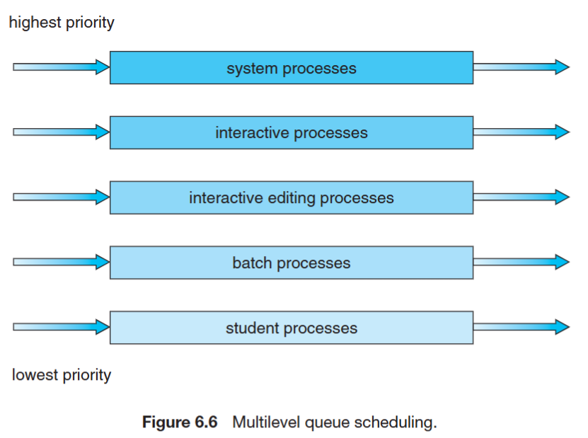

#### Multilevel Feedback Queue Scheduling

- A process can move between the various queues; aging can be implemented
- Idea: separate processes according to the characteristic of their CPU burst
  - I/O-bound and interactive processes in higher priority queue -> short CPU burst
  - CPU-bound processes in lower priority queue -> long CPU burst
- The levels of queues matter, since each queue is picked in order, from highest to lowest priority
- The reason why it is called "feedback" is that the process can be moved between queues based on its behavior in runtime

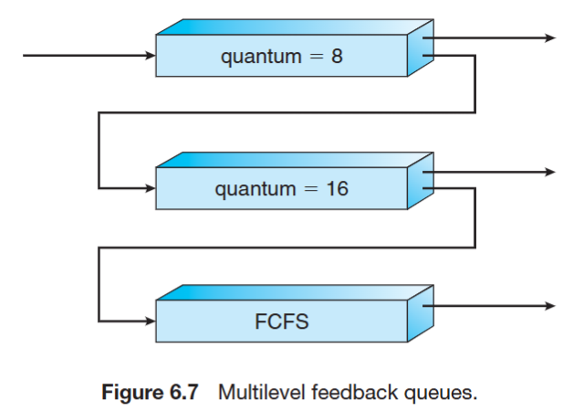

- A new job enters Q0 (the top one). Algorithm: FCFS. If it does not finish in 8 ms CPU time, job is moved to Q1
- At Q1 is again served FCFS and receives 16 ms TQ. If it still does not finish in 16 ms, it is preempted and moved to Q2
- Qi only gets executed if Q0 ~ Qi-1 is empty

- In general, multilevel feedback queue scheduler is defined by the following parameters:
  - Number of queues
  - Scheduling algorithm for each queue
  - Method used to determine when to
    upgrade a process
  - Method used to determine when to
    demote a process

#### Evaluation Methods

- Deterministic modeling – takes a particular predetermined workload and defines the performance of each algorithm for that workload
  - Cannot be generalized
- Queueing model – mathematical analysis
- Simulation – random-number generator or trace tapes for workload generation
- Implementation – the only completely accurate way for algorithm evaluation

## Multi-Processor Scheduling

- Asymmetric multiprocessing:
  - all system activities are handled by a processor (alleviating the need for data sharing)
  - the others only execute user code (allocated by the master)
  - far simpler than SMP
- Symmetric multiprocessing (SMP):
  - each processor is self-scheduling
  - all processes in common ready queue, or each has its own private queue of ready processes
  - need synchronization mechanism

### Processor affinity

- Processor affinity: a process has an affinity for the processor on which it is currently running (bind a process to a specific processor or core)
  - A process populates its recent used data in cache memory of its running processor
  - Cache invalidation and repopulation has high cost
- Solution
  - soft affinity: possible to migrate between processors
  - hard affinity: not to migrate to other processors

### NUMA (non-uniform memory access) and CPU Scheduling

- Occurs in systems containing combined CPU and memory boards
- CPU scheduler and memory-placement works together
- A process (assigned affinity to a CPU) can be allocated memory on the board where that CPU resides

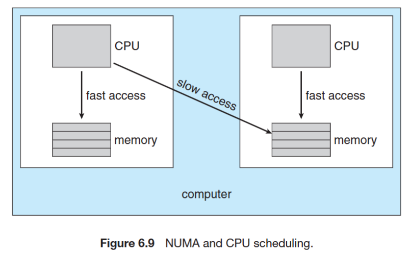

### Load-balancing

- Keep the workload evenly distributed across all processors
  - Only necessary on systems where each processor has its own private queue of eligible processes to execute
- Two strategies:
  - Push migration: move (push) processes from overloaded to idle or less-busy processor
  - Pull migration: idle processor pulls a waiting task from a busy processor
  - Often implemented in parallel
- Load balancing often counteracts the benefits of processor affinity

## Multi-core Processor Scheduling

- Multi-core Processor:
  - Faster and consume less power
  - memory stall: When access memory, it spends a significant amount of time waiting for the data become available. (e.g. cache miss)
- Multi-threaded multi-core systems:
  - Two (or more) hardware threads are assigned to each core (i.e. Intel Hyper-threading)
  - Takes advantage of memory stall to make progress on another thread while memory retrieve happens

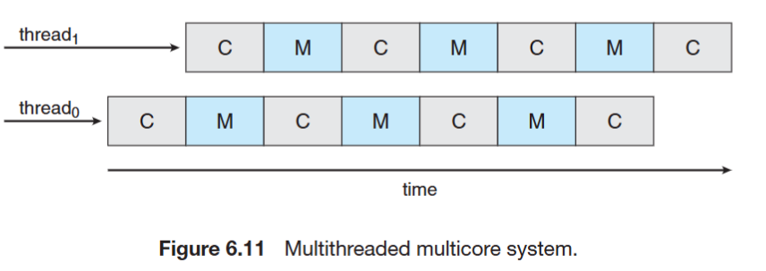
C for compute cycle, M for memory cycle

- Two ways to multithread a processor:
  - coarse-grained: switch to another thread when a memory stall occurs. The cost is high as the instruction pipeline must be flushed.
  - fine-grained (interleaved): switch between threads at the boundary of an instruction cycle. The architecture design includes logic for thread switching – cost is low.
- Scheduling for Multi-threaded multi-core systems
  - 1st level: Choose which software thread to run on each hardware thread (logical processor)
  - 2nd level: How each core decides which hardware thread to run (hardware level scheduling)

## Real-Time Scheduling

- Real-time does not mean speed, but keeping deadlines
- Soft real-time requirements:
  - Missing the deadline is unwanted, but is not immediately critical
  - Examples: multimedia streaming
- Hard real-time requirements:
  - Missing the deadline results in a fundamental failure
  - Examples: nuclear power plant controller, self-driving car

### Real-Time Scheduling Algorithms

- Use three numbers to describe a real-time periodic task:
  - (t, d, p) = (processing time, deadline, period)
  - e.g. T = (1, 2, 4) means T has 1 unit of processing time, 2 unit of deadline, and 4 unit of period time
  - The relationship between these numbers: 0 <= t <= d <= p
  - 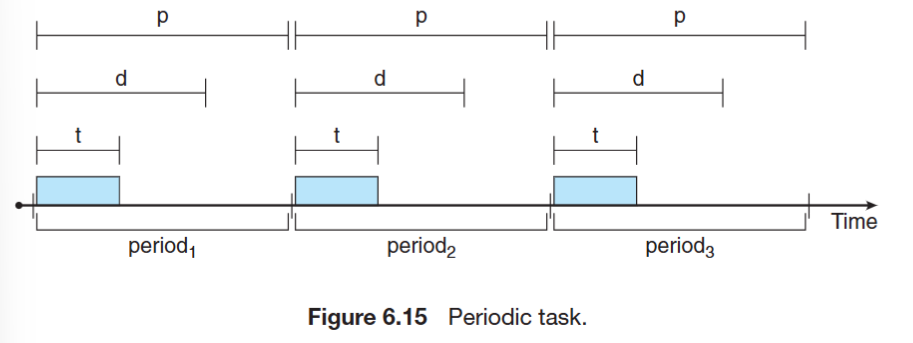
- Rate-Monotonic (RM) algorithm
  - Shorter period -> higher priority
  - Fixed-priority RTS scheduling algorithm
- Earliest-Deadline-First (EDF) algorithm
  - Earlier deadline -> higher priority
  - Dynamic priority algorithm

#### Rate-Monotonic (RM) Scheduling

- Fixed-priority schedule
  - All jobs of the same task have same priority
  - The task’s priority is fixed
- The shorter period, the higher priority
- e.g.: T1 = (4, 1), T2 = (5, 2), T3 = (20, 5) (Period, Execution)
  - period: 4 < 5 < 20
  - priority: T1 > T2 > T3
  - 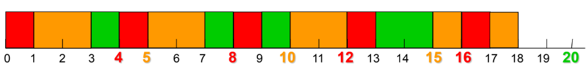

#### Early Deadline First (EDF) Scheduler

- Dynamic-priority scheduler
  - Task’s priority is not fixed
  - Task’s priority is determined by deadline.
- e.g.: T1 = (2, 0.9), T2 = (5, 2.3) (Deadline, Execution)
- 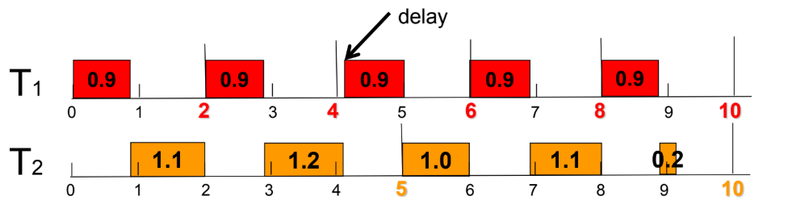

## Operating System Examples

### Solaris Scheduler

- Priority-based multilevel feedback queue scheduling
- Six classes of scheduling:
  - real-time, system, time sharing, interactive, fair share, fixed priority
- Each class has its own priorities and scheduling algorithm
- The scheduler converts the class-specific priorities into global priorities

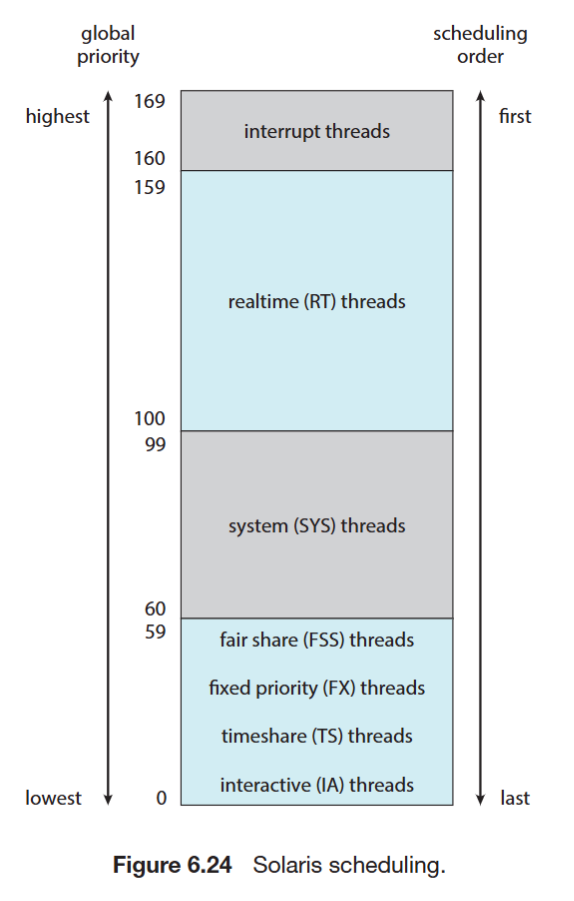

- Inverse relationship between priorities and time slices: the higher the priority, the smaller the time slice
- Time quantum expired: the new priority of a thread that has used its entire time quantum without blocking
- Return from sleep: the new priority of a thread that is returning from sleeping (I/O wait)

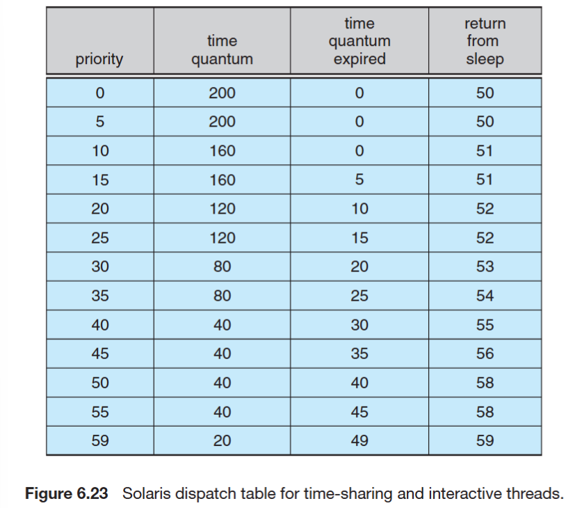

- e.g. a task with priority 50, time quantum is 40 units. If it runs over 40 units, its priority is reduced to 40. If it returns from sleep, its priority is increased to 58.

### Windows XP Scheduler

- Similar to Solaris: Multilevel feedback queue
- Scheduling: from the highest priority queue to lowest priority queue (priority level: 0 ~ 31)
  - The highest-priority thread always run
  - Round-robin in each priority queue
- Priority changes dynamically except for Real-Time class

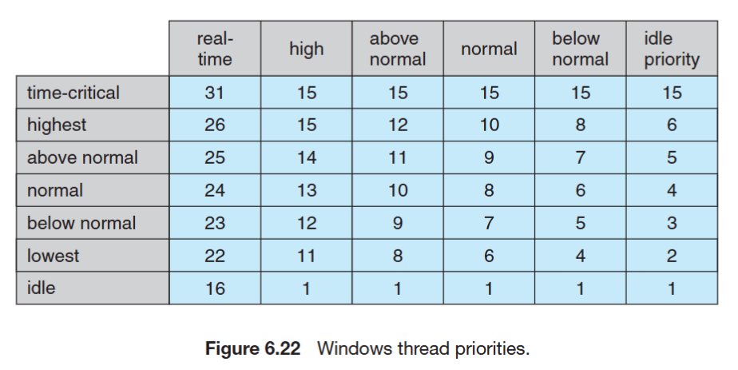

### Linux Scheduler

- Preemptive priority based scheduling
  - But allows only user mode processes to be preempted
  - Two separate process priority ranges
  - Lower values indicate higher priorities
  - Higher priority with longer time quantum
- Real-time tasks: (priority range 0 ~ 99)
  - static priorities
- Other tasks: (priority range 100 ~ 140)
  - dynamic priorities based on task interactivity
- Scheduling algorithm
  - A runnable task is eligible for execution as long as it has remaining time quantum
  - When a task exhausted its time quantum, it is considered expired and not eligible for execution
  - New priority and time quantum is given after a task is expired
