# Memory Management

Overview

- Background
- Swapping
- Contiguous Allocation
- Paging
- Segmentation
- Segmentation with Paging

## Background

- Main memory and registers are the only storage CPU can access directly
- Collection of processes are waiting on disk to be brought into memory and be executed
- Multiple programs are brought into memory to improve resource utilization and response time to users
- A process may be moved between disk and memory during its execution

How to refer memory in a program? address binding  
How to load a program into memory? static/dynamic loading and linking  
How to move a program between mem. & disk? swap  
How to allocate memory? paging, segment

Multistep processing of a user program
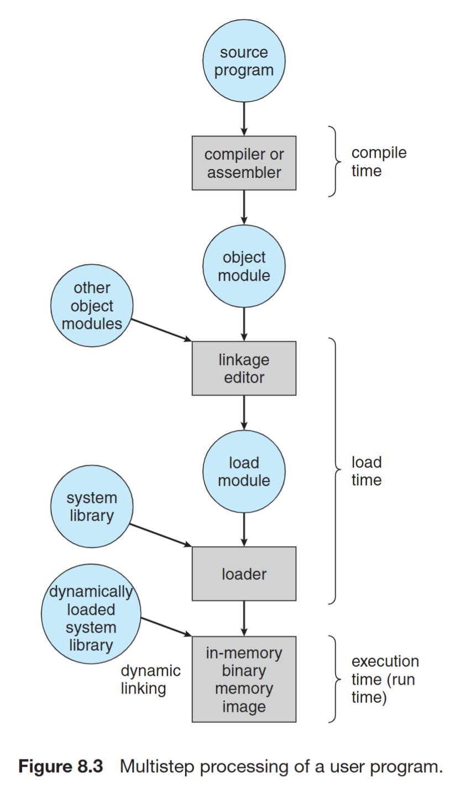

### Address Binding

- Address Binding - Compile Time
  - Program is written as symbolic code (the code that we write)
  - Compiler translates symbolic code into absolute code (the memory location is absolute)
  - If starting location chagnes -> recompile
  - used in embedded systems, where the program is loaded into a fixed location in memory


- Address binding - Load Time
  - Compiler translates symbolic code into relocatable code
  - Relocatable code: Machine language that can be run from any memory location
  - If starting location changes -> reload the code

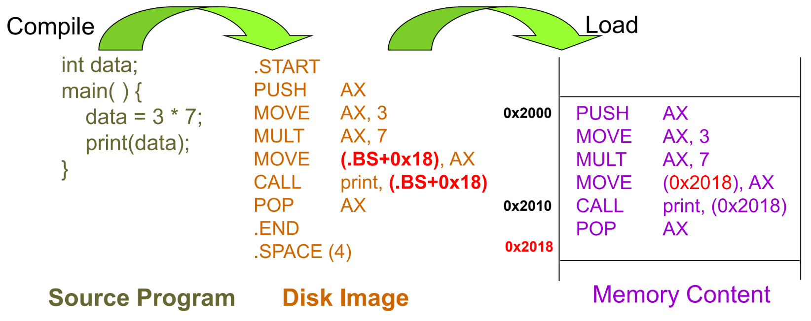

- Address Binding – Execution Time
  - Compiler translates symbolic code into logical-address (i.e. virtual-address) code
  - Special hardware (i.e. MMU) is needed for this scheme
  - Most general-purpose OS use this method

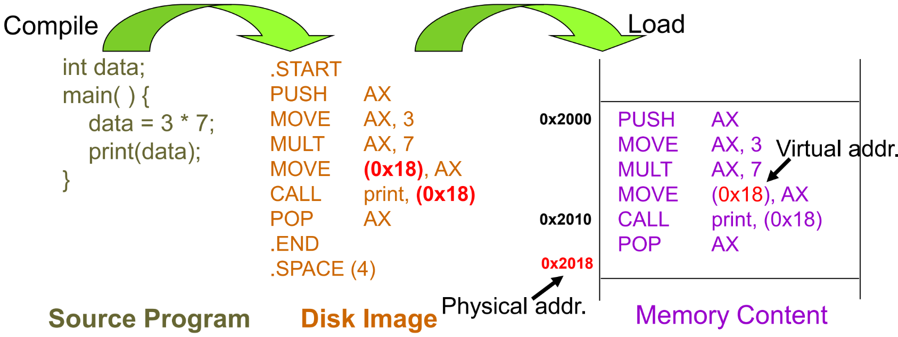

Memory-Management Unit (MMU)

- Hardware device that maps virtual to physical address
- The value in the relocation register is added to every address generated by a user process at the time it is sent to memory

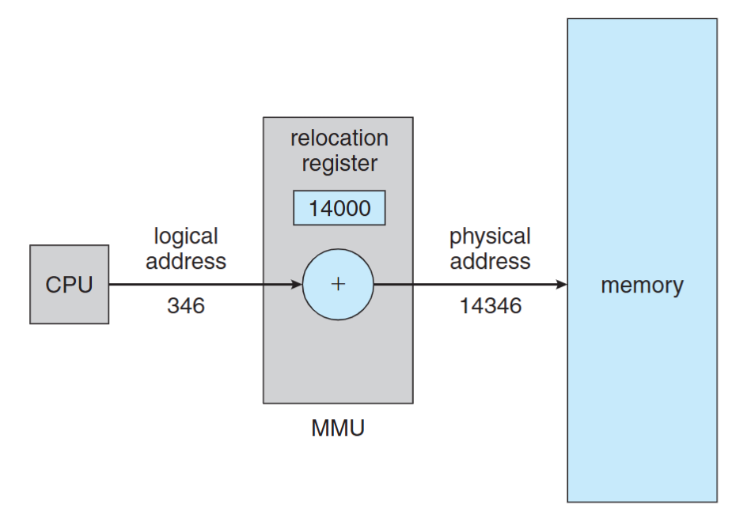

Logical Address Space vs Physical Address Space

- Logical address – generated by CPU a.k.a. virtual address
- Physical address – seen by the memory module
- compile-time & load-time address binding: logical addr = physical addr
- Execution-time address binding: logical addr != physical addr
- The user program deals with logical addresses; it never sees the real physical addresses

### Dynamic Loading

- The entire program must be in memory for it to execute? No, we can use dynamic loading. A routine (function) is loaded into memory when it is called
- Better memory utilization: unused rountine is never loaded, useful when large amounts of code are infrequently used
- No special support from OS is required implemented through program (library, API calls)

Dynamic Loading Example in C

- `dlopen()`: opens a library and prepares it for use
- `dlsym()`: looks up the value of a symbol in a given (opened) library.
- `dlclose()`: closes a DL library

```c
#include <dlfcn.h>
int main() {
    double (*cosine)(double);
    void* handle = dlopen ("/lib/libm.so.6", RTLD_LAZY);
    cosine = dlsym(handle, "cos");
    printf ("%f\n", (*cosine)(2.0));
    dlclose(handle);
}
```

In the above example, the library is not loaded to memory until the `dlsym()` (`cosine = dlsym(handle, "cos");`) function is called.

### Static Linking

libraries are combined by the loader into the program in-memory image (the default behavior of the linker)

- Waste memory: duplicated code, e.g. Both programs use the same library, but the library is loaded into memory twice
- Faster during execution time

(Notice that dynamic loading let the program load a library at runtime, it didn't solve the problem of duplicated libraries or code)

### Dynamic Linking

Linking porstponed until execution time

- Only one code copy in memory and shared by everyone
- A stub is included in the program in-memory image for each library reference
- Stub call -> check if the referred lib is in memory -> if not, load the lib -> execute the lib
- DLL (Dynamic link library) on Windows

When we compile a program, we need to tell linker to use dynamic linking or static linking.

## Swapping

- A process can be swapped out of memory to a backing store, and later brought back into memory for continuous execution
- Also used by midterm scheduling, different from context switch
- Backing store – a chunk of disk, separated from file system, to provide direct access to these memory images
- Why Swap a process: Free up memory, swap lower-priority process with a higher one
- Swap back memory location
  - If binding is done at compile/load time -> swap back memory address must be the same
  - If binding is done at execution time -> swap back memory address can be different
- A process to be swapped -> must be idle (CPU and I/O idle)
  - Never swap a process with pending I/O
  - I/O operations are done through OS buffers (memory space not belongs to any user processes)
- Major part of swap time is transfer time

## Contiguous Memory Allocation

Fixed-partition allocation:

- Each process loads into one partition of fixed-size
- Degree of multi-programming is bounded by the number of partitions

Variable-size partition:

- Hole: block of contiguous free memory
- Holes of various size are scattered in memory

Dynamic Storage Allocation Problem

- First-fit: allocate the 1st hole that fits
- Best-fit: allocate the smallest hole that fits, must search through the whole list
- Worst-fit: allocate the largest hole, must also search through the whole list

Fragmentation

- External Fragmentation: total free memory space is enough, but not contiguous. Occur in variable-size allocation
- Internal fragmentation: Memory that is internal to a partition but is not being used, occur in fixed-partition allocation
- Solution: compaction
  - Shuffle the memory contents to place all free memory together in one large block at execution time. Only if binding is done at execution time

## Non-contiguous Memory Allocation - Paging

### Paging Concept

Method:

- Divide physical memory into fixed-sized blocks called frames
- Divide logical address space into blocks of the same size called pages

To run a program of n pages, need to find n free frames and
load the program. OS need to set up a page table to translate logical to physical addresses

Benefit:

- Allow the physical-address space of a process to be noncontiguous
- Avoid external fragmentation
- Limited internal fragmentation
- Provide shared memory/pages

Page Table

- Maps the logical memory to physical memory
- A structure maintained by OS for each process
  - Page table includes only pages owned by a process
  - A process cannot access memory outside its space

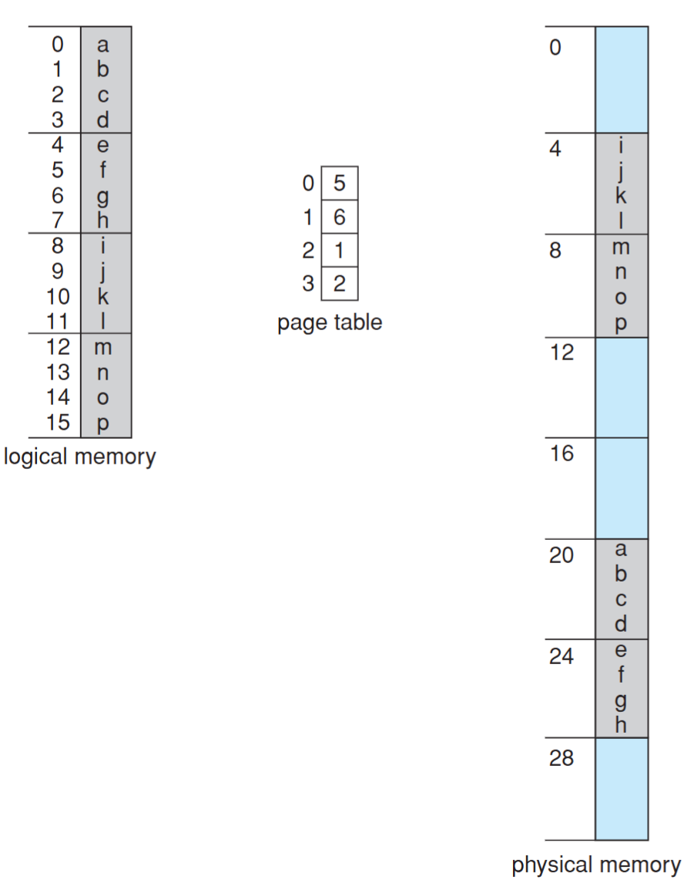

### Address Translation Scheme

Logical address is divided into two parts:

- Page number (p)

  - used as an index into a page table which contains base address of each page in physical memory
  - $N$ bits means a process can allocate at most $2^N$ pages

- Page offset (d)
  - combined with base address to define the physical memory address that is sent to the memory unit
  - $N$ bits means the page size is $2^N$

Physical address = page base address + page offset

For example, if the page size is 1KB ($2^{10}$) and page 2 maps to frame 5. What is the physical address of p = 2, d = 20?

phisical address = 5 \* (1KB) + 20 = 1,010,000,000,000 + 0,000,010,100 = 1,010,000,010,100

Total number of pages does not need to be the same as
the total number of frames

- Total # pages determines the logical memory size of a process
- Total # frames depending on the size of physical memory

e.g. Given 32 bits logical address, 36 bits physical address and 4KB page size, what does it mean? (這邊 32 bits logical address 是指一個地址用 32 bits 表示)

- Page table size = $2^{32} / 2^{12} = 2^{20}$ entries
- Max program memory = $2^{32}$ Bytes = 4GB
- Total physical memory size = $2^{36}$ Bytes = 64GB
- Number of bits for page number = $2^{20}$ pages -> 20 bits
- Number of bits for frame number = $2^{36} / 2^{12} = 2^{24}$ -> 24bits
- Number of bits for page offset = 4KB page size -> 12 bits

OS also need to maintain a free-frame list to keep track of free frames in memory. When a process is created, the OS allocates a number of frames to the process and updates the free-frame list.

### Page/Frame Size

The page (frame) size is defined by hardware

- Typically a power of 2
- Ranging from 512 bytes to 16MB / page
- 4KB / 8KB page is commonly used

Internal fragmentation?

- Larger page size -> More space waste

But page sizes have grown over time

- memory, process, data sets have become larger
- better I/O performance (during page fault)
- page table is smaller

### Implementation of Page Table

- Page table is stored in memory
- Page table base register (PTBR)
  - The physical memory address of the page table
  - The PTBR value is stored in PCB (Process Control Block)
  - Changing the value of PTBR during Context-switch
- With PTBR, each memory reference results in two memory accesses, one for the page table and one for the frame
- The 2-access problem can be solved by Translation Look-aside Buffers (TLB) (HW) which is implemented by Associative memory (HW)

### Associative memory

All memory entries can be accessed at the same time. Each entry corresponds to an associative register. But number of entries are limited. Typical number of entries: 64 ~ 1024

### Translation Look-aside Buffer (TLB)

- A cache for page table shared by all processes
- TLB must be flushed after a context switch. Otherwise, TLB entry must has a PID field (address-space identifiers (ASIDs))

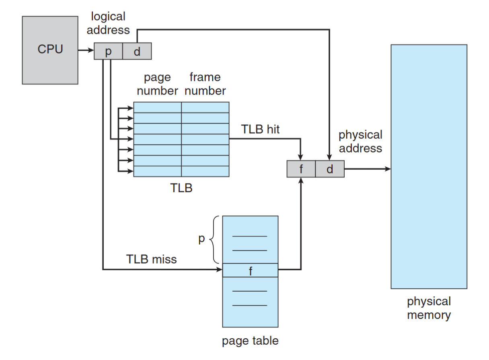

The reason why we need to flush is because differnet program may have the same page number, but different frame number. If we don't flush, the TLB may return the wrong frame number.

Effective Memory-Access Time  
e.g. 20 ns for TLB search, 100 ns for memory access

- 70% TLB hit-ratio: EMAT = 0.70 x (20 + 100) + (1 - 0.70) \* (20 + 100 + 100) = 150 ns
- 98% TLB hit-ratio: EMAT = 0.98 x 120 + 0.02 x 220 = 122 ns

### Memory Protection

Each page is associated with a set of protection bit in the page table

- e.g., a bit to define read/write/execution permission

Common use: valid-invalid bit

- Valid: the page/frame is in the process' logical address space, and is thus a legal page
- Invalid: the page/frame is not in the process' logical address space

Valid-Invalid Bit Example

- Un-used page entry cause memory waste -> use page table length register (PTLR)
- Process memory may NOT be on the boundary of a page -> memory limit register is still needed

### Shared Pages

- Paging allows processes share common code, which must be reentrant
- Reentrant code:
  - It never change during execution
  - text editors, compilers, web servers, etc
- Only one copy of the shared code needs to be kept in physical memory, two (several) virtual addresses are mapped to one physical address

### Page Table Memory Structure

- Page table could be huge and difficult to be loaded
  - e.g. 4GB ($2^{32}$) logical address space with 4KB ($2^{12}$) page needs 1 million ($2^{20}$) page table entry. Assume each entry need 4 bytes (32bits), the total size = 4MB
  - It's hard to find a contiguous 4MB space in memory, so we need to break it into several smaller page tables
- Solutions:
  - Hierarchical Paging
  - Hashed Page Table
  - Inverted Page Table

#### Hierarchical Paging

Break up the logical address space into multiple page tables

e.g. Two-level paging (32-bit address with 4KB ($2^{12}$) page size)

- 12-bit offset (d) -> 4KB page size
- 10-bit outer page number -> 1K page table entries
- 10-bit inner page number -> 1K page table entries
- 3 memory accesses

#### Hashed Page Table

- Commonly-used for address > 32 bits
- Virtual page number is hashed into a hash table
- The size of the hash table varies: Larger hash table -> smaller chains in each entry
- Each entry in the hashed table contains: Virtual Page Number, Frame Number, Next Pointer
- Pointers waste memory
- Traverse linked list waste time & cause additional memory references
- We can impove it by using hashed page table. Each linked list entry contains a table of virual page numbers and frame numbers.

#### Inverted Page Table

By using inverted page table (frame table), we only need to maintain one page table for all processes, since the number of frames (the physical memory) are fixed.

- Maintains NO page table for each process
- Maintains a frame table for the whole memory
- One entry for each real frame of memory
- Each entry in the frame table has (PID, Page Number)
- Eliminate the memory needed for page tables but increase memory access time
- Each access needs to search the whole frame table
- Hard to support shared page/memory

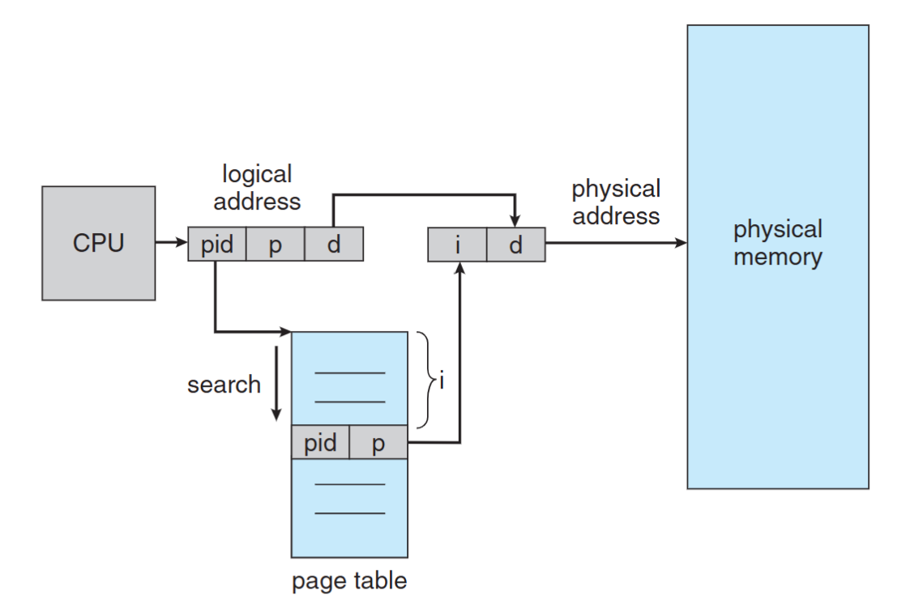

## Non-Contiguous Memory Allocation — Segmentation

- Memory-management scheme that supports user view of memory
  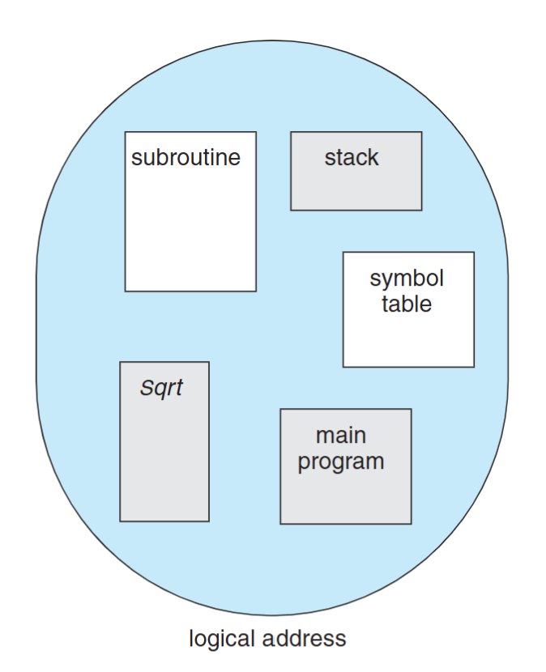
- A program is a collection of segments. A segment is a logical unit such as:
  - main program
  - function, object
  - local/global variables
  - stack, symbol table
  - arrays, etc...

### Segmentation Table

- Logical address: (seg#, offset)
- maps two-dimensional physical addresses; each table entry has:
  - Base (4 bytes): the start physical addr
  - Limit (4 bytes): the length of the segment

In the process control block (PCB), we need to maintain the following information:

- Segment-table base register (STBR): the physical addr of the segmentation table
- Segment-table length register (STLR): the # of segments

### Segmentation Hardware

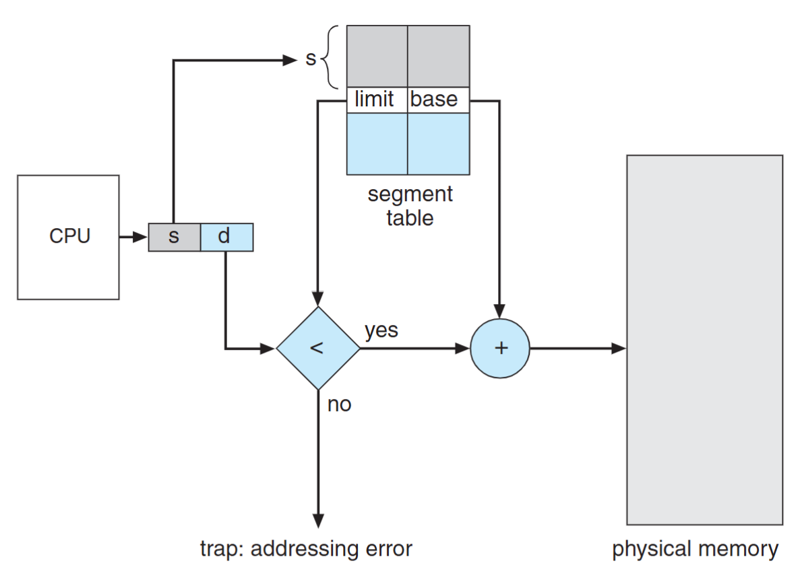

- Limit register is used to check offset length
- MMU allocate memory by assigning an appropriate base address for each segment

### Address Translation Comparison

Segment

- Table entry: (segment base addr, limit)
- Segment base addr can be arbitrary
- The length of “offset” is the same as the physical memory size

Page:

- Table entry: (frame base addr)
- Frame base addr = frame number \* page size
- The length of “offset” is the same as page size

### Protection & Sharing

- Protection bits associated with segments
  - Read-only segment (code)
  - Read-write segments (data, heap, stack)
- Code sharing occurs at segment level
  - Shared memory communication
  - Shared library
- Share segment by having same base in
  two segment tables

## Segmentation with Paging

- Apply segmentation in logical address space
- Apply paging in physical address space

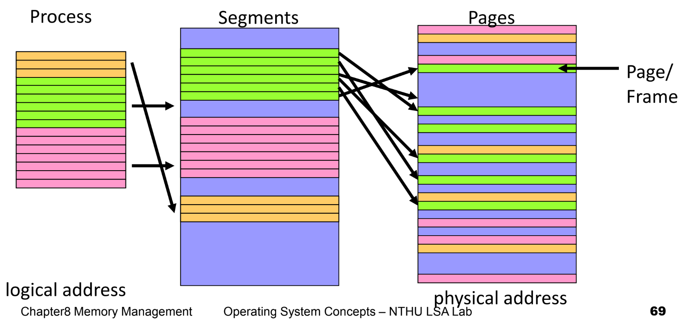

### Address Translation

CPU generates logical address

- Given to segmentation unit, produces linear addresses
- Linear address given to paging unit, generates physical address in main memory

Segmentation and paging units form equivalent of MMU

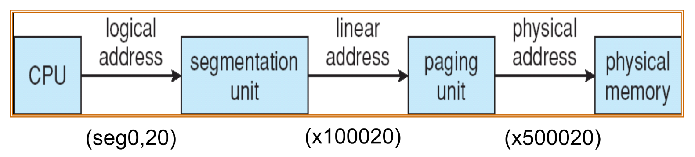

### Example: The Intel Pentium

- Logical-address space is divided into 2 partitions:
  - 1st: 8K(213) segments (private), local descriptor table (LDT)
  - 2nd: 8K(213) segments (shared), global descriptor table (GDT)
- Logical address:
  - max # of segments per process = $2^{14}$
  - size of a segment $\leq 2^{32}$ = 4GB

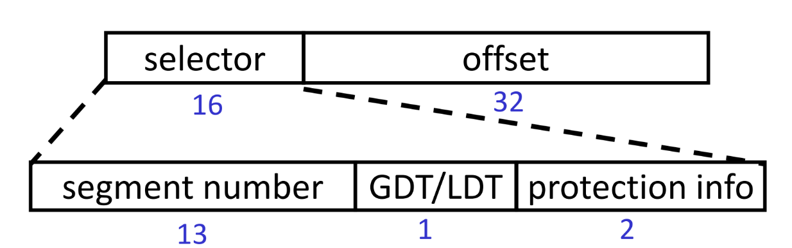

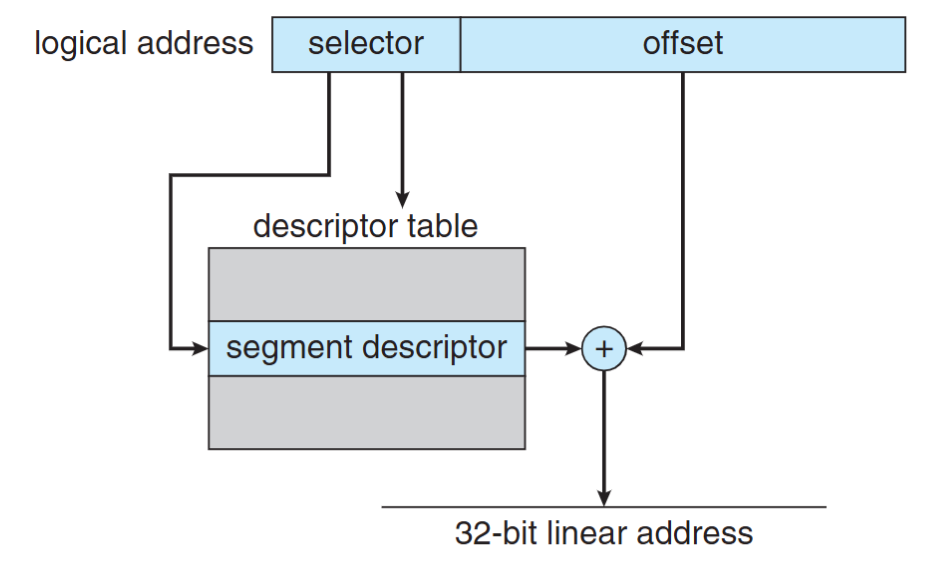

The IA-32 architecture allows a page size of either 4 KB or 4 MB.

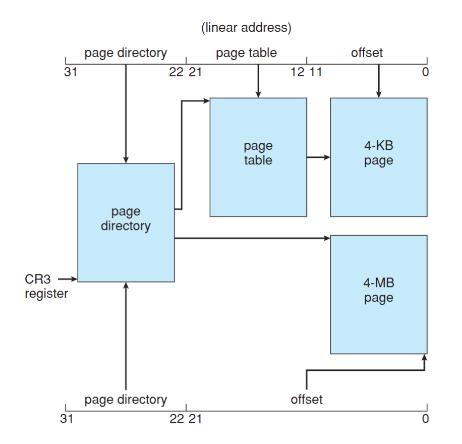

### Example Question

Let the physical mem size is 512B, the page size is 32B and the logical address of a program can have 8 segments. Given a 12 bits hexadecimal logical address "448", translate the addr. With blow page and segment tables.

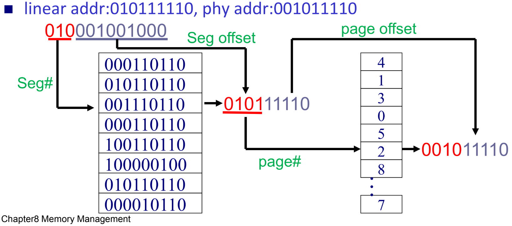
